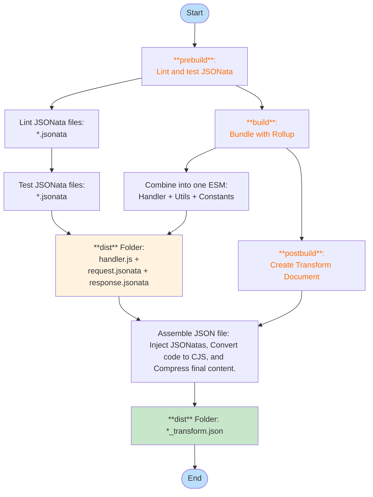

# Node.js Transform Document Builder

This is a specialized tool for building Node.js transform documents designed for the Coherent platform.
Think of this as your go-to solution when standard JSONata transforms aren't quite enough for your needs.
It's designed for those moments when you need to do more than simple data mapping—like implementing
[MapReduce][map-reduce] patterns, orchestrating multi-step business logic, or processing complex
unstructured data that requires a mix of [JSONata][jsonata] expressions (or [fast-xml-parser][fast-xml-parser]
for XML data), and custom JavaScript logic. Plus, it easily integrates with Coherent Spark's
[Execute API (v3)][exec-v3] to help you build sophisticated data transformation pipelines.

> **Heads up!**
>
> This tool is here to give you a solid foundation for building Node.js transform documents
> with JSONata workflows, but it's not a complete out-of-the-box solution. You may think of it as getting
> you about 80% of the way there; the final 20% will depend on your specific data contract and how your
> business logic flows. If you're tackling something more complex, consider this a great starting point
> that you can build upon and customize to fit your exact needs.

## TL;DR

This repository helps you create a production-ready [handler](src/handler.ts) — a Node.js transform document
in JSON format that you can deploy to Coherent Spark. It does this by combining JSONata expressions,
JavaScript code, and Coherent Spark's [Execute API (v3)][exec-v3] into a single, deployable package.

To get you started quickly, the build scripts will generate a sample transform document in the `dist`
directory. This sample demonstrates a "volume of a cylinder" calculation, so you'll want to customize
the [request.jsonata](transforms/request.jsonata) and [response.jsonata](transforms/response.jsonata)
files to match your own data contract and business logic. The sample data in the [assets](./assets/)
folder follows the same example. Oh, and don't forget to create a `.env` file (you can use
[.env.local](.env.local) as a template) with the environment variables you'll need for building and
deploying your transform.

- Then, using Node.js 22, run the following commands:

```bash
# Install dependencies (only the first time)
npm install

# Build the transform document
npm run build

# Deploy the transform document (only if you need to upload it to Coherent)
npm run deploy
```

Now, if you are **curious** about how the final transform document is built and tested, please read on.

## Table of Contents

- [Getting Started](#getting-started)
- [Prerequisites](#prerequisites)
- [Installation](#installation)
- [Usage](#usage)
- [Workflow](#workflow)
- [Limitations](#limitations)

## Getting Started

The tool is designed to help you handle complex unstructured data transformations with ease by:

- transforming data using JSONata expressions for request/response mapping
- executing Excel-based business logic via Coherent Spark's Execute API (v3)

But its real power is the scaffolding it provides for building complex data transformation pipelines.
It takes into account different stages of the build process, including request/response mapping,
data validation, and error handling.

## Prerequisites

Before getting started, confirm that you have the following:

- [Node.js](https://nodejs.org/) (version 22 or higher)
- Valid credentials for Spark execution environment, including tenant, folder, and service names.
- Access to deploy and manage [transform documents](https://docs.coherent.global/spark-apis/transforms-api/transform-documents-apis).

## Installation

- Clone this repository

```bash
  git clone <repository-url>
  cd node-transform-builder
```

- Install dependencies

```bash
npm install
```

- Run the test suite to ensure everything is working:

```bash
npm test && npm run test:e2e
```

- Create a `.env` file in the project root with appropriate settings:

```env
TRANSFORM_MODE="Node" # node | jsonata
TRANSFORM_NAME="my-transform-name"
TRANSFORM_EXTERNAL_DOMAINS="*.coherent.global,*.googleapis.com"
CSPARK_BASE_URL=https://spark.my-env.coherent.global/my-tenant-name
CSPARK_BEARER_TOKEN=Bearer <my-access-token>
```

> **NOTE**: `CSPARK_BASE_URL` and `CSPARK_BEARER_TOKEN` are useful for publishing transform
> documents to the Coherent platform as part of the deployment process relies on the
> [Coherent Spark TypeScript SDK][cspark-sdk].

## Usage

### Basic Usage

The primary workflow involves building transform documents (and optionally deploying them):

```bash
# Build the project and create transform documents
npm run build

# Run the example handler
npm run example

# Format code
npm run format
```

### Creating Transform Documents

Transform documents are automatically generated during the build process:

1. `request.jsonata` and `response.jsonata` are validated
2. TypeScript is compiled to JavaScript (ES Module format)
3. Transform documents are created in the `dist/` directory

## Workflow

### 1. Architecture and Pipeline



### 2. Build Process

The build process consists of several automated steps:

1. **prebuild** - JSONata expression validation and testing
2. **build** - TypeScript compilation using Rollup
3. **postbuild** - Transform document generation

### 3. JSONata Processing

The system uses two main JSONata expressions:

- **Request Transform** (`transforms/request.jsonata`): maps unstructured input data to Spark-compatible format
- **Response Transform** (`transforms/response.jsonata`): maps Spark response back to expected output format

### 4. Error Handling

The system implements comprehensive error handling:

- **Compilation Errors**: invalid JSONata expressions are caught during build
- **Runtime Errors**: API failures are handled gracefully with structured error responses
- **Validation Errors**: input data validation with meaningful error messages

## Limitations

- No batch or asynchronous processing capabilities (i.e. the tool is synchronous).
- Large payloads may hit API timeout limits (i.e., 60 seconds).
- Very complex JSONata transformations may impact performance (less than 6 MB payload).
- Field Mapping requires exact field name matching for proper transformations.

## Copyright and License

[Apache-2.0](LICENSE)

<!-- References -->
[exec-v3]: https://docs.coherent.global/spark-apis/execute-api/execute-api-v3
[jsonata]: https://jsonata.org/
[fast-xml-parser]: https://www.npmjs.com/package/fast-xml-parser
[map-reduce]: https://en.wikipedia.org/wiki/MapReduce
[cspark-sdk]: https://www.npmjs.com/package/@cspark/sdk
